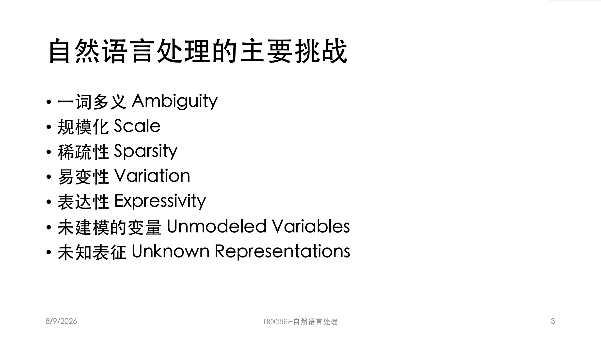
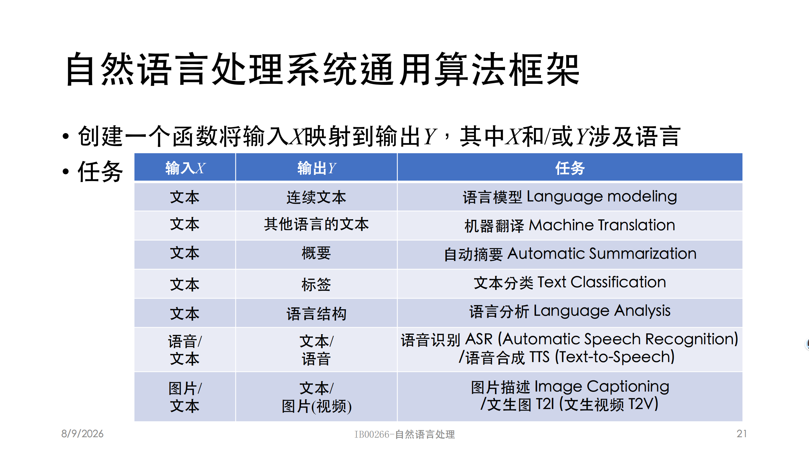
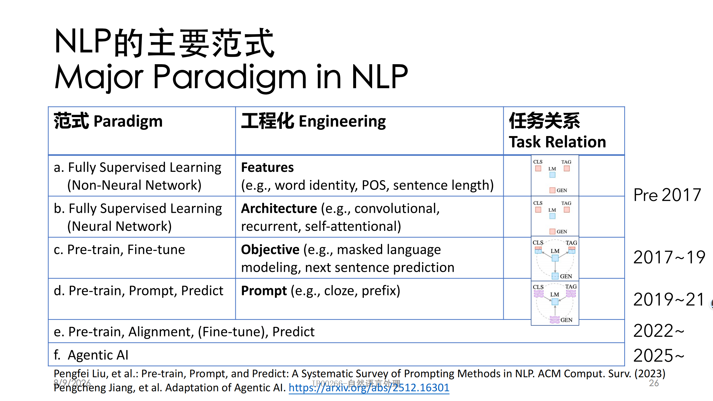

# 自然语言处理第二周学习笔记
## 知识框架


> 这节课主要讲了自然语言处理的七大挑战、算法框架、代码实现
##主要挑战

> 一词多义（Ambiguity）：核心难点。包括词层面多义（bank、apple、“意思”）、词性多义（chair）、句法多义（“我们在火车上写标语”）、句法与语义同时多义（"We saw the woman with the telescope"）

> 规模化（Scale）：语言众多、任务繁杂，全球有数千种语言

> 稀疏性（Sparsity）：与齐夫定律（Zipf's Law）相关——词频与排名成反比（Freq ∝ 1/n），大量低频词导致数据稀疏

> 易变性（Variation）：数据分布偏移、新词不断涌现（Covid、Niubility、“润”）

> 表达性（Expressivity）：同一意思多种表述（父亲/爸爸/爹爹，我吃饭了/吾已用膳）

> 未建模的变量：世界知识（“杯子摔碎”vs“锤子打碎玻璃”的指代需要常识）

> 未知表征：如何把人类知识转化为机器表示，如何表示词、句子、语境和常识



> 其中，所谓齐夫定律就是指，在自然语言的词频统计里：把词语按出现频次从高到低排序，一个词的频次，大致和它的排名成反比。
\(f(r) \propto \frac{1}{r}\)

做词表的时候，保留前 N 个高频词，剩下全部归`<UNK>`未知词，本质就是利用齐夫分布

我们可以尝试将这七大挑战用一个通俗的话语总结起来：世界上有很多语言（规模化），这些语言中有许多词语有很多意思（一词多义），而且有的词语不常用（稀疏性），有的时候会出现新词（易变性）。同一个意思有不同的表达方式（表达性）。交流的时候还需要一定的常识（未建模的变量）。这些话要怎么说给机器听（未知表征）。

##算法框架



> 创建一个NLP系统有三种方法：规则、微调、提示词



## NLP的主要范式


| 范式 Paradigm | 工程化 Engineering | 任务关系 Task Relation |
| ---- | ---- | ---- |
| a. Fully Supervised Learning<br>(Non-Neural Network)<br>**全监督学习（非神经网络）** | Features<br>(e.g., word identity, POS, sentence length)<br>**特征**<br>（例：词本身、词性、句子长度） | Pre 2017<br>2017年之前 |
| b. Fully Supervised Learning<br>(Neural Network)<br>**全监督学习（神经网络）** | Architecture (e.g., convolutional, recurrent, self-attentional)<br>**网络架构**<br>（例：卷积、循环、自注意力） | Pre 2017<br>2017年之前 |
| c. Pre-train, Fine-tune<br>**预训练 + 微调** | Objective (e.g., masked language modeling, next sentence prediction)<br>**训练目标**<br>（例：掩码语言建模、下一句预测） | 2017~19 |
| d. Pre-train, Prompt, Predict<br>**预训练 + 提示 + 预测** | Prompt (e.g., cloze, prefix)<br>**提示**<br>（例：完形填空、前缀提示） | 2019~21 |
| e. Pre-train, Alignment, (Fine-tune), Predict<br>**预训练 + 对齐 +（微调）+ 预测** | — | 2022~ |
| f. Agentic AI<br>**智能体AI** | — | 2025~ |


##代码实现：情感分析
>完整情感分类系统分为 5 步：

>1. **特征抽取 Featurization**：把文本转为机器可计算特征
2. **得分 Scoring**：特征加权求和得到分数
3. **决策规则 Decision Rule**：分数映射成类别标签
4. **精度计算 Accuracy Calculation**：评估模型效果
5. **错误分析 Error Analysis**：分析失败样本，迭代改进系统
### 3.1 读取数据集 `read_xy_data`

```
def read_xy_data(filename: str) -> tuple[list[str], list[int]]:
    x_data = []
    y_data = []
    with open(filename, 'r', encoding="utf-8") as f:
        for line in f:
            label, text = line.strip().split('|||')
            x_data.append(text)
            y_data.append(int(label))
    return x_data, y_data

# 加载训练、测试集
x_train, y_train = read_xy_data("../data/sst‑sentiment‑text‑threeclass/train.txt")
x_test, y_test = read_xy_data("../data/sst‑sentiment‑text‑threeclass/test.txt")
```
>这份代码就是将文件夹里的数据根据划分规则，读取到x,y的数据列表里。为了实现这个功能定义了一个read_xy_data的函数
### 3.2 特征抽取 `extract_features`

```
def extract_features(x: str) -> dict[str, float]:
    features = {}
    x_split = x.split()

    good_words = ['love','good','nice','great','enjoy','enjoyed']
    bad_words  = ['hate','bad','terrible','disappointing','sad','lost','angry']

    for word in x_split:
        if word in good_words:
            features["good_word_count"] = features.get("good_word_count",0)+1
        if word in bad_words:
            features["bad_word_count"]  = features.get("bad_word_count",0)+1
    # 偏置项bias，提供基础默认分数
    features["bias"] = 1.0
    return features

# 特征权重（人为设定）
feature_weights = {
    "good_word_count": 1.0,
    "bad_word_count": -1.0,
    "bias": 0.5
}
```
>这份代码实现的是计算x数据集里代表情感好与坏的数量，定义了一个extract_features函数。并且初始化特征权重
### 3.3 分类器运行（得分 + 决策规则）`run_classifier`

```
def run_classifier(x: str) -> int:
    features = extract_features(x)
    score = 0.0
    for feat_name, feat_val in features.items():
        w = feature_weights.get(feat_name, 0.0)
        score += feat_val * w
    # 简单决策
    if score > 0:
        return 1   # positive
    elif score < 0:
        return -1  # negative
    else:
        return 0   # neutral
```
>这段代码实现的就是一个计算分数，因为之前特征提取的函数已经计算了坏情绪与好情绪的数量，只需要权重*数量求和就能计算出是好情绪多还是坏情绪多
最终根据判断与0的大小来判断缺陷的好坏
### 3.4 精度计算 `calculate_accuracy`

```
def calculate_accuracy(x_data: list[str], y_data: list[int]) -> float:
    total = 0
    correct = 0
    for x, y_true in zip(x_data, y_data):
        y_pred = run_classifier(x)
        total += 1
        if y_pred == y_true:
            correct +=1
    return correct / total

train_acc = calculate_accuracy(x_train, y_train)
test_acc  = calculate_accuracy(x_test, y_test)
print(f"Train accuracy: {train_acc:.4f}")
print(f"Test accuracy:  {test_acc:.4f}")
```
>这段代码实现的就是计算预测的精读。通过计算预测正确的数量/总预测数量的标准进行衡量
### 3.5 错误分析 `find_errors`

```
import random

def find_errors(x_data, y_data):
    error_ids = []
    for idx, (x, y_true) in enumerate(zip(x_data, y_data)):
        y_pred = run_classifier(x)
        if y_pred != y_true:
            error_ids.append(idx)
    # 随机打印5条错误样例
    for _ in range(5):
        eid = random.choice(error_ids)
        print(f"文本：{x_data[eid]}")
        print(f"真实标签：{y_data[eid]}，预测标签：{run_classifier(x_data[eid])}\n")

find_errors(x_train, y_train)
```
>这段代码实现的就是打印出预测错误的案例

##总结
这堂课主要学习了自然语言处理的基础知识，即七大挑战与算法框架，最终通过一个代码实现来展示出最基本的流程是怎样的。我认为，挑战就是方向，一定有许多论文在解决着这些问题。而算法框架与代码实现则展示了工程上的方法与优化的地方。
