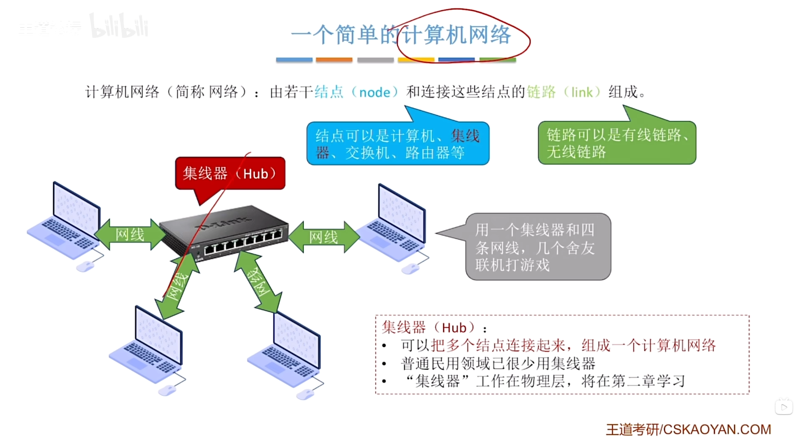
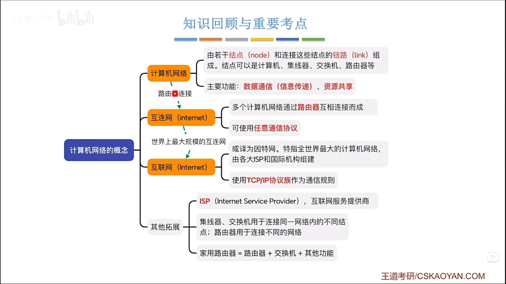
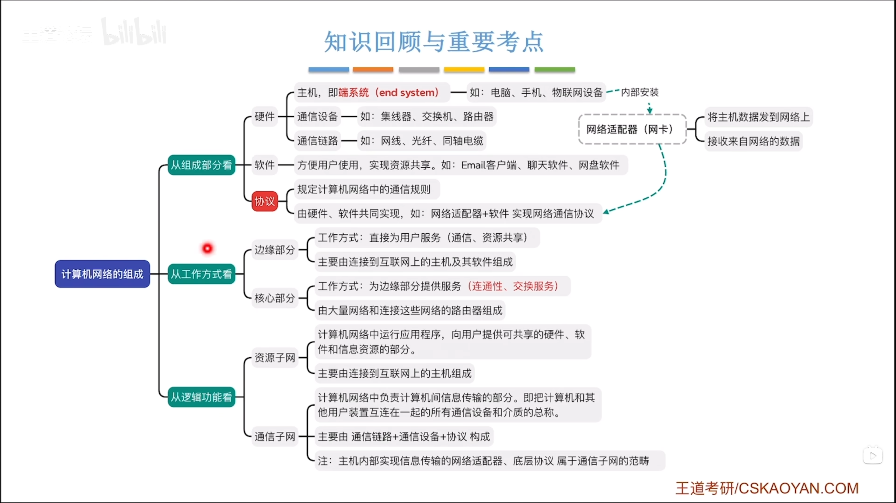
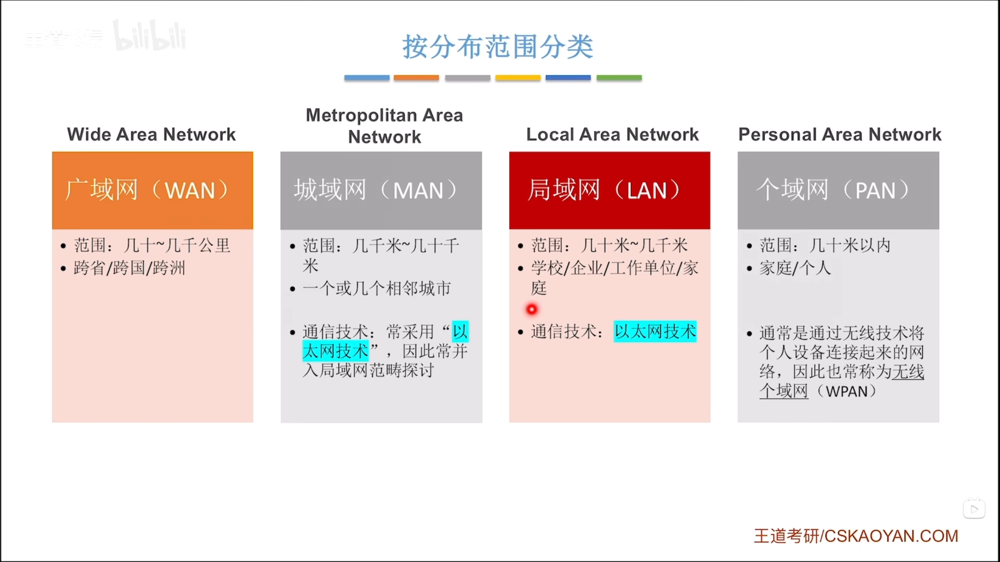
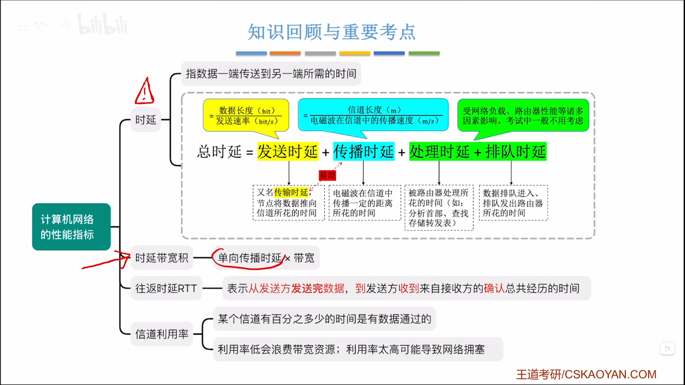
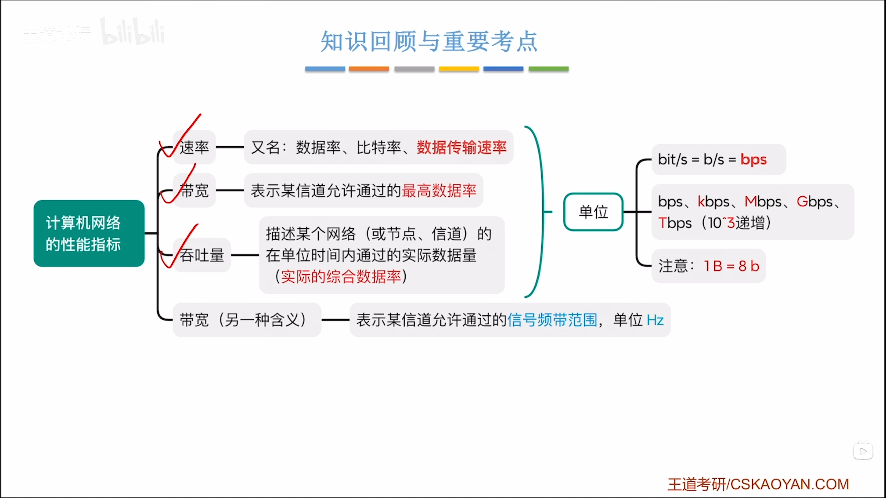

# 概述

> 这是计算机网络的第一节课笔记。主要内容是定义、组成、分类、交换技术、性能指标

##计算机网络定义

> 计算机网络定义：计算机网络，是将若干台独立的计算机（主机），通过通信设备和传输介质连接起来，在网络协议的控制下，实现资源共享和信息交换的系统。

###相关概念辨析

##计算机网络组成

##计算机网络分类

| 分类依据 | 类别 | 核心特点 | 典型例子 |
| ---- | ---- | ---- | ---- |
| 地理覆盖范围 | PAN | 个人 10 米内 | 蓝牙 |
| | LAN | 小范围、高速、单位管理 | 宿舍以太网 / WiFi |
| | MAN | 覆盖一座城市 | 城市宽带主干 |
| | WAN | 跨远距离、运营商建设 | 互联网主干 |
| 拓扑结构 | 星型 | 中心节点，现代局域网主流 | 交换机组网 |
| | 总线型 | 共享一根总线，老式以太网 | 10BASE2 同轴以太网 |
| | 环型 | 数据沿环传输 | 令牌环网 |
| | 网状 | 多冗余链路，高可靠 | 互联网主干 |
| 交换方式 | 电路交换 | 建立独占通路 | 传统电话 |
| | 分组交换 | 存储转发，拆分分组 | 互联网 IP |
| 使用者 | 公用网 | 面向公众 | 电信宽带 |
| | 专用网 | 单位私有 | 企业内网 |
| 服务模型 | C/S | 服务器提供资源 | 网站 HTTP |
| | P2P | 主机对等 | BT 下载 |

### 选择题 1

> 下列关于局域网 LAN 的叙述，正确的是（）

A. LAN 覆盖范围广，跨多个城市
B. LAN 一般由电信运营商负责建设维护
C. LAN 传输速率较高，误码率低
D. 互联网主干属于局域网

**答案：C**
解析：
A：WAN 范围广；B：LAN 由单位自行管理；D：互联网主干是 WAN。

### 选择题 2

> 互联网主干网采用的拓扑结构是（）

A. 总线型
B. 星型
C. 全连接网状
D. 部分网状

**答案：D**
解析：主干网节点之间有多条冗余链路，但**不是每个节点都和所有节点直连**，属于部分网状。全网状成本太高。

### 选择题 3

> 个人使用蓝牙耳机连接手机，该网络属于（）

A. LAN
B. PAN
C. MAN
D. WAN

**答案：B**
解析：PAN 个人区域网，范围 10 米以内。

### 简答题（期末常考）

> 题目：简述 LAN、MAN、WAN 三者的主要区别。
> **参考答案**

1. 覆盖地理范围不同：LAN 最小，局限于单位 / 房间；MAN 覆盖一座城市；WAN 跨城市、国家。
2. 建设管理主体不同：LAN 由机构自建；WAN 一般由通信运营商建设。
3. 性能差异：LAN 速率高、时延小；WAN 速率较低，传播时延大。
4. 核心设备：LAN 多用交换机；WAN 依靠路由器实现跨网互联。

##计算机网络交换技术

| 交换方式 | 定义 | 优点 | 缺点 | 典型例子 |
| ---- | ---- | ---- | ---- | ---- |
| 电路交换 | 通信前预先在收发双方建立一条专用物理通路，通信全程独占该链路，通信结束后释放连接 | 1. 通信时延小 2. 有序传输，无乱序 3. 无冲突，独占链路 4. 适合连续大量实时数据传输 | 1. 建立连接耗时较长 2. 线路独占，资源利用率低 3. 链路故障直接中断通信 4. 差错控制能力弱 | 老式固定电话网 |
| 报文交换 | 采用存储-转发机制，不需要预先建立连接；交换节点接收完整报文，再查找路由进行转发 | 1. 无需预先建立连接 2. 线路利用率高 3. 支持不同速率链路互通 4. 支持差错校验、重传与多目标转发 | 1. 节点需缓存完整报文，内存压力大 2. 转发时延大，收完整个报文才可转发 3. 大报文易引发网络拥塞 | 早期电报系统 |
| 分组交换 | 采用存储-转发机制，将长报文切分为较短的分组，每个分组携带独立首部，分组独立路由转发，目的主机重组还原报文 | 1. 无需建连（数据报），传输灵活 2. 分组短小，转发时延更小 3. 缓存压力小，可靠性高 4. 出错仅重传单个分组 | 1. 每个分组携带首部，存在额外开销 2. 分组可能乱序，目的端需要重组 3. 存在排队时延，易产生拥塞 | 互联网IP网络 |

### 一、选择题
>1. 互联网采用的交换技术是（ ）

A. 电路交换
B. 报文交换
C. 分组交换
D. 混合交换

**答案：C**
**解析：**现代计算机网络全部基于分组交换，采用存储转发、分片传输。

>2. 下列关于电路交换的说法正确的是（ ）

A. 线路利用率高
B. 无需建立连接
C. 传输时延小，适合实时通信
D. 采用存储转发

**答案：C**
**解析：**电路交换一旦建链，时延极小，适合语音实时通信；利用率低、需要建链、无存储转发。

>3. 可以实现不同速率链路通信、无需提前建立连接的是（ ）

A. 电路交换
B. 报文交换、分组交换
C. 仅电路交换
D. 仅虚电路交换

**答案：B**
**解析：**存储转发类交换无需独占链路，可适配不同速率。

### 二、判断题
>1. 电路交换在传输数据阶段没有排队时延和转发时延。（√）

**解析：**通路独占，无需存储转发，直接传输。

>2. 报文交换相比分组交换时延更小，效率更高。（×）

**解析：**报文必须完整接收才能转发，时延远大于分组交换。

>3. 分组交换中，所有分组必须沿同一条路径传输。（×）

**解析：**IP数据报方式分组独立选路，可乱序、不同路径。

### 三、简答题（必考）
>1. 为什么互联网采用分组交换而不采用电路交换？

**标准答案：**
1. 计算机数据具有突发性，电路交换独占链路、资源利用率极低。
2. 分组交换无需持续占用链路，链路可共享，网络利用率高。
3. 分组短小，转发灵活、拥塞影响小、容错性高。
4. 电路交换适合恒定速率实时业务，不适合计算机数据传输。

>2. 报文交换与分组交换的核心区别？

**标准答案：**
报文交换以**完整报文**为单位存储转发；
分组交换将大报文**分片**，以**分组**为单位独立转发，时延更小、可靠性更高。

### 四、计算题真题（交换时延对比）
> 题目
报文长度 8Mb，链路带宽 1Mb/s，两段链路，每段传播时延 1s。
分别求：报文交换、分组交换（分组大小1Mb）总时延。

**标准答案：**
1. 报文交换
发送时延 = 8/1 = 8s
总时延 = 发送时延×2 + 传播时延×2 = 16 + 2 = **18s**

2. 分组交换
流水线转发
总时延 = 发送时延 + 链路数×传播时延 + (链路数-1)×分组发送时延
= 1 + 2×1 + 1×1 = **4s**

##计算机网络的性能

| 指标 | 定义 | 计算公式 | 单位 | 关键考点 |
| ---- | ---- | ---- | ---- | ---- |
| 速率（带宽） | 信道单位时间内传输的最大数据量 | 速率 = 数据量 / 时间 | bit/s（bps） | 1 Byte = 8 bit；带宽指最高速率 |
| 吞吐量 | 单位时间内实际成功传输的数据量 | 吞吐量 = 实际传输数据量 / 时间 | bit/s | 吞吐量 ≤ 带宽 |
| 发送时延 | 主机把分组推向链路所需时间 | 发送时延 = 分组长度(bit) / 带宽(bit/s) | s | 由分组长度、带宽决定 |
| 传播时延 | 信号在介质上从一端到另一端的时间 | 传播时延 = 链路长度(m) / 传播速率(m/s) | s | 由距离、介质决定，与带宽无关 |
| 处理时延 | 节点解析分组首部、查路由表的时间 | 通常忽略（由CPU决定） | s | 计算题默认忽略 |
| 排队时延 | 分组在队列中等待输出链路空闲的时间 | 随机值，由拥塞程度决定 | s | 计算题默认忽略 |
| 时延带宽积 | 链路上能容纳的比特数（管道容量） | 时延带宽积 = 传播时延 × 带宽 | bit | 第一个比特到达时发送方已发出的比特数 |
| 往返时间 RTT | 发送方发出数据到收到确认的总时间 | RTT = 双向传播时延 + 接收方处理时间 | s | 不包含发送时延；TCP超时重传依赖它 |
| 信道利用率 | 信道有数据通过的时间占比 | 利用率 = 有数据时间 / 总时间 | %（百分比） | 利用率越高，排队时延越大，越拥塞 |

### 一、选择题
>1. 增大链路带宽，可以减小以下哪一项时延？（ ）

A. 传播时延
B. 发送时延
C. 处理时延
D. 排队时延

**答案：B**
**解析：**发送时延=分组长度/带宽，带宽增大发送时延减小；传播时延仅和距离、介质有关。

>2. 信号在光纤中的传播速率约为（ ）

A. 3×10⁸ m/s
B. 2×10⁸ m/s
C. 2×10⁵ m/s
D. 2×10³ m/s

**答案：B**
**解析：**真空光速为3×10⁸ m/s，光纤介质中传播速率约 2×10⁸ m/s。

>3. 时延带宽积的单位是（ ）

A. bit/s
B. s
C. bit
D. Hz

**答案：C**
**解析：**时延带宽积 = 传播时延 × 带宽，单位为 bit，表示链路最大容纳比特数量。

>4. 关于信道利用率说法正确的是（ ）

A. 利用率越高网络性能越好
B. 利用率越高排队时延越大
C. 利用率100%时时延最小
D. 利用率与拥塞无关

**答案：B**
**解析：**信道利用率升高，网络拥塞加剧，排队时延会急剧增大。

### 二、判断题
>1. 带宽越大，信号在网线中的传播速度越快。（×）

**解析：**传播速度由传输介质决定，与带宽大小无关。

>2. 时延带宽积代表链路中最多可存放的比特数。（√）

**解析：**类比管道容量，是链路瞬时容纳的最大比特量。

>3. 吞吐量的数值可以大于信道带宽。（×）

**解析：**带宽是理论速率上限，吞吐量是实际速率，吞吐量 ≤ 带宽。

### 三、简答题（必考）
>1. 简述发送时延与传播时延的区别？

**标准答案：**
发送时延是主机将分组推送到链路的时间，由分组长度和带宽决定；传播时延是信号在介质上传输的时间，由链路距离、介质速率决定。提高带宽只能减小发送时延，无法改变传播时延。

>2. 为什么信道利用率不能达到100%？

**标准答案：**
信道利用率过高，网络拥塞严重，分组排队时延急剧增大，总时延大幅上升，网络整体性能下降，因此不能满负载运行。

### 四、计算题真题（时延计算核心）
> 题目
主机发送1000bit分组，链路带宽100bit/s，链路长度2000km，信号传播速率2×10⁸m/s。忽略处理、排队时延。
求：发送时延、传播时延、总时延、时延带宽积。

**标准答案：**
发送时延 = 1000 / 100 = 10 s
传播时延 = 2000×10³ / 2×10⁸ = 0.01 s
总时延 = 10 + 0.01 = 10.01 s
时延带宽积 = 0.01 × 100 = 1 bit

